> Álvaro Ronco Acebal

# 01 Ejercicio de Git - trabajo en local

[TOC]

## Preguntas

1. **Inicializa un nuevo repositorio Git en una carpeta llamada  "forty" y agrega los archivos  proporcionados en el aula virtual. Realiza el primer commit.** 

   ```bash
   git init
   ```

   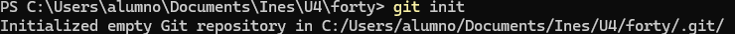

   ```bash
   git add .
   git commit -m "Commit inicial"
   ```

   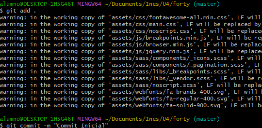

2. **Renombra la rama master a  main, si es necesario.**  

   ```bash
   git branch -m master main
   ```

   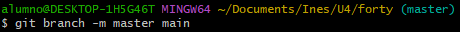

3. **Haz que los ficheros  README.txt,  LICENSE.txt ,  ficheros con extensión  passwords.txt , y también todos los  .md, sean ignorados por el control de versiones.**

   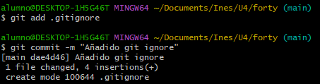

   

4. **Crea el archivo  passwords.txt.  Lista los archivos ignorados, comprueba que esté  correcto.**

   ```bash
   git check-ignore -v
   ```

   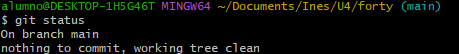

5. **Crea una rama llamada  "feature-content". Cambia, en la línea 3477, el  1.5em en el archivo  main.css.**

   ```bash
   git checkout -b feature-content
   git add main.css
   git commit -m "Modifica 1.5em en main.css"
   ```

   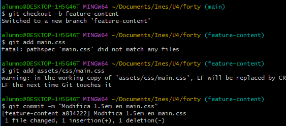

6. **Elimina el archivo  "passwords.txt" en la carpeta  repositorio. ¿Hay cambios pendientes?**

   ```bash
   git status
   ```

   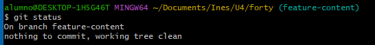

   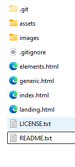

7. **Crea un nuevo archivo llamado "``about.html``", partiendo del archivo  generic.html y  agrégalo al repositorio.**

   ```bash
   git add about.html
   ```

   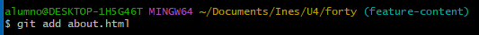

   ```bash
   git commit -am "Cambios en main.css y añadido about"
   ```

   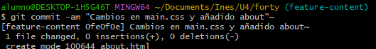

8. **Cambia a la rama  ``main``. Examina los logs del repositorio de forma gráfica.**

   ```bash
   git checkout main
   git log --oneline --graph --all --decorate
   ```

   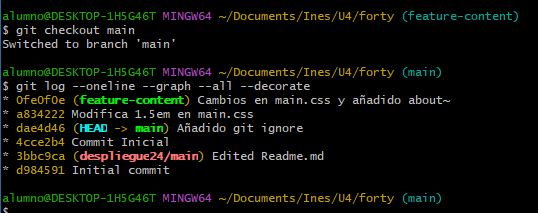

9. **Vuelve a la rama ``feature-content``. Modifica algo en el archivo  ``generic.html``, comprueba que hay cambios, y realiza otro  commit . Examina los logs del repositorio de forma gráfica.**  

   ```bash
   git checkout feature-content
   git status
   git add .
   git commit -m "cambios en generic"
   ```

   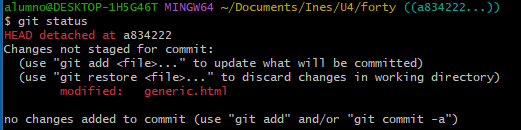

   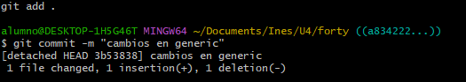

10. **Modifica algo en el fichero  elements.html. Confirma los cambios, pero no hagas  commit. Mira el estado del repositorio.** 

    ```bash
    git status
    ```

    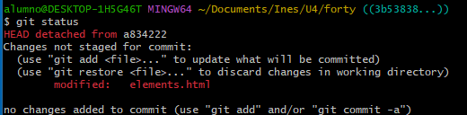

11. **Mira las diferencias de  elements.html. Los cambios  no nos gustan, deshaz los cambios  de  elements.html. Comprueba que no hay cambios pendientes. Vemos que se ha borrado texto... deshacemos los cambios completamente y  comprobamos que no hay cambios pendientes .**

    ```bash
    git diff elements.html
    git checkout -- elements.html
    git status
    ```

    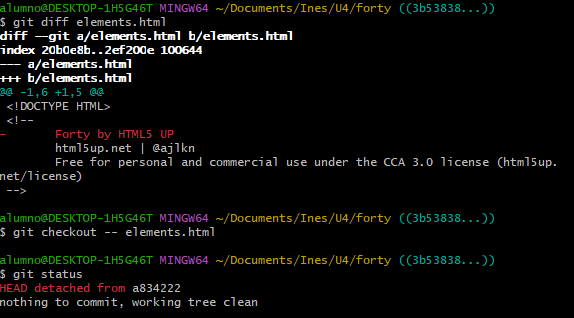

12. **Muestra las diferencias entre la rama actual y la rama principal (main).**

    ```bash
    git diff main
    ```

    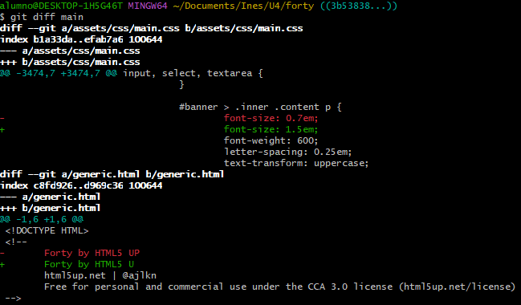

13. **Fusiona la rama  "feature-content" con la rama principal. Muestra los logs del  repositorio de una forma gráfica y completa.**

    ```bash
    git checkout main
    git merge feature-content
    git log --oneline --all --decorate --graph
    ```

    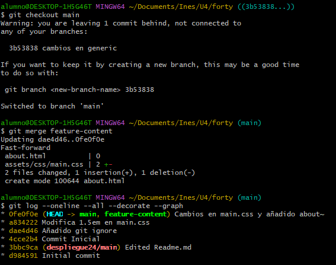

14. **Crea una nueva rama llamada " hotfix" y en ella, corrige un error crítico en el archivo  "``index.html``". (Por ejemplo, añade el enlace a la nueva página about.html)**

    ```bash
    git checkout -b hotfix
    git add index.html
    git commit -m "Corrige error critico en index.html añaiendo un enlace a about.html"
    ```

    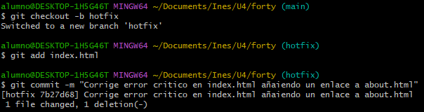

15. **Fusiona la rama  "hotfix" con la rama principal y verifica el historial de commits de  forma que se vean todas las ramas gráficamente.**

    ```bash
    git checkout main
    git merge hotfix
    git log --oneline --all --decorate --graph
    ```

    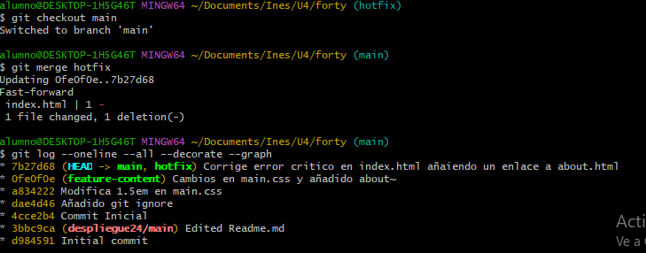

16. **Muestra el historial de cambios limitado a los últimos 3 commits.**

    ```bash
    git log -n 3
    ```

    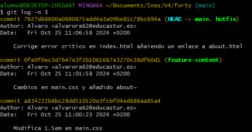

17. **Etiqueta el commit actual como "v1.0" y muestra las etiquetas existentes.**

    ```bash
    git tag v1.0
    git tag -l
    ```

    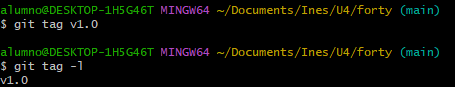
